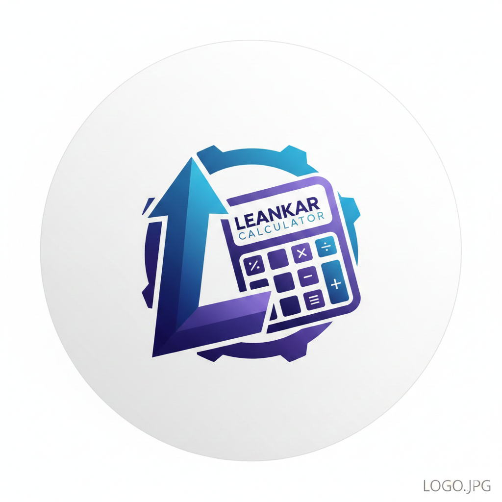

# Calculadora Neumórfica / Neumorphic Calculator / Calculadora Neumórfica

<p align="center">
  
</p>

---

## Idiomas / Languages / Idiomas

- [Português (BR)](#português-br)
- [English](#english)
- [Español](#español)

---

# Português (BR)

## Calculadora Neumórfica

Uma calculadora Flutter com design neumórfico moderno, desenvolvida seguindo as melhores práticas de arquitetura e testes.

### Funcionalidades

- Operações aritméticas básicas: adição, subtração, multiplicação e divisão
- Cálculo de porcentagem
- Suporte a entrada via teclado físico
- Design neumórfico elegante
- Suporte a tema claro/escuro
- Separador decimal com vírgula (padrão brasileiro)
- Tratamento de erro para divisão por zero
- Histórico de cálculos com persistência local
- Copiar/colar resultados (Ctrl+C / Ctrl+V)
- Formatação automática de números grandes
- Calculadora de IMC com classificação e peso ideal
- Tela de configurações (tema e idioma)
- Suporte a 5 idiomas: inglês, espanhol, francês, italiano e português (Brasil)
- Anúncios banner com fluxo próprio de consentimento (AdMob)

### Capturas de Tela

A calculadora apresenta um design neumórfico com botões em alto-relevo e display em baixo-relevo, proporcionando uma experiência visual moderna e agradável.

### Atalhos de Teclado

| Tecla | Ação |
|-------|------|
| `0-9` | Inserir números |
| `+`, `-`, `*`, `/` | Operações |
| `,` ou `.` | Separador decimal |
| `Enter` ou `=` | Calcular resultado |
| `Backspace` | Apagar último dígito |
| `Escape` ou `Delete` | Limpar tudo |
| `%` | Calcular porcentagem |
| `C` | Limpar display |
| `Ctrl+C` | Copiar resultado |
| `Ctrl+V` | Colar número |
| `H` | Abrir histórico |

### Como Executar

```bash
# Clonar o repositório
git clone <url-do-repositorio>

# Entrar no diretório
cd calculator_leankar

# Instalar dependências
flutter pub get

# Executar o app
flutter run

# Executar testes
flutter test

# Analisar código
flutter analyze
```

### Tecnologias

- **Dart SDK** ^3.12.0
- [flutter_neumorphic_plus](https://pub.dev/packages/flutter_neumorphic_plus) - Design neumórfico
- [shared_preferences](https://pub.dev/packages/shared_preferences) - Persistência local
- [intl](https://pub.dev/packages/intl) - Formatação de números e suporte a i18n
- [package_info_plus](https://pub.dev/packages/package_info_plus) - Informações de versão do app
- [google_mobile_ads](https://pub.dev/packages/google_mobile_ads) - Anúncios banner (AdMob)
- `flutter_localizations` - Internacionalização (5 idiomas)

### Arquitetura

O app segue um padrão de controllers (`ChangeNotifier`) + páginas + widgets, com dependências injetadas via construtor (fallback para singleton `.instance`) — sem framework de DI:

```
lib/
├── main.dart                              # Ponto de entrada
├── app_calculator.dart                    # Configuração do app (tema, rotas)
├── controllers/
│   ├── calculator_controller.dart         # Lógica da calculadora (ChangeNotifier)
│   ├── calculator_state.dart              # Estado imutável da calculadora
│   ├── imc_controller.dart                # Lógica do IMC
│   ├── settings_controller.dart           # Tema/idioma
│   ├── ad_consent_controller.dart         # Fluxo de consentimento de anúncios (UMP)
│   └── ad_consent_state.dart
├── models/
│   ├── calculation_history.dart           # Modelo do histórico de cálculos
│   └── imc_result.dart                    # Modelo do resultado de IMC
├── pages/
│   ├── calculator_page.dart               # Tela principal (StatefulWidget)
│   ├── imc_calculator_page.dart           # Tela de IMC
│   └── settings_page.dart                 # Tela de configurações
├── services/
│   ├── ad_mob_service.dart                # Integração com AdMob
│   ├── error_handler.dart                 # Tratamento centralizado de erros
│   ├── logger_service.dart                # Serviço de logging para debug
│   └── storage_service.dart               # Persistência com SharedPreferences
├── widgets/
│   ├── ads/                               # Banner de anúncios e placeholder
│   ├── imc/                               # Widgets da calculadora de IMC
│   ├── settings/                          # Widgets da tela de configurações
│   └── ...                                # Widgets da calculadora (botão, display, teclado, histórico)
├── utils/
│   ├── constants/                         # Cores, tamanhos, strings, IDs de anúncio
│   ├── enums/                             # Tipos de erro, operações, IMC, etc.
│   ├── extensions/                        # Extensões de localização
│   ├── number_formatter.dart              # Formatação de números grandes
│   ├── responsive_utils.dart              # Utilitários responsivos
│   └── result.dart                        # Padrão Result para tratamento de erros
└── l10n/                                  # Arquivos .arb (en, es, fr, it, pt, pt_BR) + código gerado
```

### Testes

O projeto possui cobertura ampla de testes, organizados espelhando a estrutura de `lib/`:

```
test/
├── controllers/    # Testes de calculator/imc/settings/ad_consent controllers
├── mocks/          # Mocks manuais (storage, logger, error handler, ad_mob)
├── models/         # Testes de modelos (ex.: imc_result)
├── pages/          # Testes das páginas (calculator, imc, settings)
├── services/       # Testes de serviços (ex.: ad_mob_service)
├── utils/          # Testes de formatação e enums
├── helpers/        # Utilitários de teste (app de teste com l10n)
└── widgets/        # Testes de widgets, incluindo ads/, imc/ e settings/
```

**Total: 370 testes automatizados**

### Padrões de Código

- Todos os widgets são implementados como classes (`StatelessWidget` ou `StatefulWidget`)
- Gerenciamento de estado com `ChangeNotifier` e estado imutável (`copyWith`)
- Separação de responsabilidades entre UI e lógica
- Nomenclatura consistente e em inglês
- Testes automatizados para todas as funcionalidades, com mocks injetados via construtor

---

# English

## Neumorphic Calculator

A Flutter calculator with modern neumorphic design, developed following best practices for architecture and testing.

### Features

- Basic arithmetic operations: addition, subtraction, multiplication, and division
- Percentage calculation
- Physical keyboard input support
- Elegant neumorphic design
- Light/dark theme support
- Comma as decimal separator (Brazilian standard)
- Error handling for division by zero
- Calculation history with local persistence
- Copy/paste results (Ctrl+C / Ctrl+V)
- Automatic formatting for large numbers
- BMI calculator with classification and ideal weight
- Settings screen (theme and language)
- Support for 5 languages: English, Spanish, French, Italian, and Portuguese (Brazil)
- Banner ads with a custom consent flow (AdMob)

### Screenshots

The calculator features a neumorphic design with embossed buttons and engraved display, providing a modern and pleasant visual experience.

### Keyboard Shortcuts

| Key | Action |
|-----|--------|
| `0-9` | Insert numbers |
| `+`, `-`, `*`, `/` | Operations |
| `,` or `.` | Decimal separator |
| `Enter` or `=` | Calculate result |
| `Backspace` | Delete last digit |
| `Escape` or `Delete` | Clear all |
| `%` | Calculate percentage |
| `C` | Clear display |
| `Ctrl+C` | Copy result |
| `Ctrl+V` | Paste number |
| `H` | Open history |

### How to Run

```bash
# Clone the repository
git clone <repository-url>

# Enter the directory
cd calculator_leankar

# Install dependencies
flutter pub get

# Run the app
flutter run

# Run tests
flutter test

# Analyze code
flutter analyze
```

### Technologies

- **Dart SDK** ^3.12.0
- [flutter_neumorphic_plus](https://pub.dev/packages/flutter_neumorphic_plus) - Neumorphic design
- [shared_preferences](https://pub.dev/packages/shared_preferences) - Local persistence
- [intl](https://pub.dev/packages/intl) - Number formatting and i18n support
- [package_info_plus](https://pub.dev/packages/package_info_plus) - App version info
- [google_mobile_ads](https://pub.dev/packages/google_mobile_ads) - Banner ads (AdMob)
- `flutter_localizations` - Internationalization (5 languages)

### Architecture

The app follows a controller (`ChangeNotifier`) + pages + widgets pattern, with dependencies injected via constructor (falling back to a `.instance` singleton) — no DI framework:

```
lib/
├── main.dart                              # Entry point
├── app_calculator.dart                    # App configuration (theme, routes)
├── controllers/
│   ├── calculator_controller.dart         # Calculator business logic (ChangeNotifier)
│   ├── calculator_state.dart              # Immutable calculator state
│   ├── imc_controller.dart                # BMI business logic
│   ├── settings_controller.dart           # Theme/language
│   ├── ad_consent_controller.dart         # Ad consent flow (UMP)
│   └── ad_consent_state.dart
├── models/
│   ├── calculation_history.dart           # Calculation history model
│   └── imc_result.dart                    # BMI result model
├── pages/
│   ├── calculator_page.dart               # Main screen (StatefulWidget)
│   ├── imc_calculator_page.dart           # BMI screen
│   └── settings_page.dart                 # Settings screen
├── services/
│   ├── ad_mob_service.dart                # AdMob integration
│   ├── error_handler.dart                 # Centralized error handling
│   ├── logger_service.dart                # Logging service for debug
│   └── storage_service.dart               # Persistence with SharedPreferences
├── widgets/
│   ├── ads/                               # Ad banner and placeholder
│   ├── imc/                               # BMI calculator widgets
│   ├── settings/                          # Settings screen widgets
│   └── ...                                # Calculator widgets (button, display, keypad, history)
├── utils/
│   ├── constants/                         # Colors, sizes, strings, ad unit IDs
│   ├── enums/                             # Error types, operations, BMI, etc.
│   ├── extensions/                        # Localization extensions
│   ├── number_formatter.dart              # Large number formatting
│   ├── responsive_utils.dart              # Responsive utilities
│   └── result.dart                        # Result pattern for error handling
└── l10n/                                  # .arb files (en, es, fr, it, pt, pt_BR) + generated code
```

### Tests

The project has broad test coverage, mirroring the `lib/` structure:

```
test/
├── controllers/    # Calculator/imc/settings/ad_consent controller tests
├── mocks/          # Hand-written mocks (storage, logger, error handler, ad_mob)
├── models/         # Model tests (e.g. imc_result)
├── pages/          # Page tests (calculator, imc, settings)
├── services/       # Service tests (e.g. ad_mob_service)
├── utils/          # Formatting and enum tests
├── helpers/        # Test helpers (l10n-aware test app)
└── widgets/        # Widget tests, including ads/, imc/, and settings/
```

**Total: 370 automated tests**

### Code Standards

- All widgets are implemented as classes (`StatelessWidget` or `StatefulWidget`)
- State management with `ChangeNotifier` and immutable state (`copyWith`)
- Separation of concerns between UI and logic
- Consistent naming conventions in English
- Automated tests for all features, with mocks injected via constructor

---

# Español

## Calculadora Neumórfica

Una calculadora Flutter con diseño neumórfico moderno, desarrollada siguiendo las mejores prácticas de arquitectura y pruebas.

### Funcionalidades

- Operaciones aritméticas básicas: suma, resta, multiplicación y división
- Cálculo de porcentaje
- Soporte para entrada por teclado físico
- Diseño neumórfico elegante
- Soporte para tema claro/oscuro
- Coma como separador decimal (estándar brasileño)
- Manejo de errores para división por cero
- Historial de cálculos con persistencia local
- Copiar/pegar resultados (Ctrl+C / Ctrl+V)
- Formato automático para números grandes
- Calculadora de IMC con clasificación y peso ideal
- Pantalla de configuración (tema e idioma)
- Soporte para 5 idiomas: inglés, español, francés, italiano y portugués (Brasil)
- Anuncios banner con flujo propio de consentimiento (AdMob)

### Capturas de Pantalla

La calculadora presenta un diseño neumórfico con botones en relieve y pantalla hundida, proporcionando una experiencia visual moderna y agradable.

### Atajos de Teclado

| Tecla | Acción |
|-------|--------|
| `0-9` | Insertar números |
| `+`, `-`, `*`, `/` | Operaciones |
| `,` o `.` | Separador decimal |
| `Enter` o `=` | Calcular resultado |
| `Backspace` | Borrar último dígito |
| `Escape` o `Delete` | Limpiar todo |
| `%` | Calcular porcentaje |
| `C` | Limpiar pantalla |
| `Ctrl+C` | Copiar resultado |
| `Ctrl+V` | Pegar número |
| `H` | Abrir historial |

### Cómo Ejecutar

```bash
# Clonar el repositorio
git clone <url-del-repositorio>

# Entrar en el directorio
cd calculator_leankar

# Instalar dependencias
flutter pub get

# Ejecutar la app
flutter run

# Ejecutar pruebas
flutter test

# Analizar código
flutter analyze
```

### Tecnologías

- **Dart SDK** ^3.12.0
- [flutter_neumorphic_plus](https://pub.dev/packages/flutter_neumorphic_plus) - Diseño neumórfico
- [shared_preferences](https://pub.dev/packages/shared_preferences) - Persistencia local
- [intl](https://pub.dev/packages/intl) - Formato de números y soporte de i18n
- [package_info_plus](https://pub.dev/packages/package_info_plus) - Información de versión de la app
- [google_mobile_ads](https://pub.dev/packages/google_mobile_ads) - Anuncios banner (AdMob)
- `flutter_localizations` - Internacionalización (5 idiomas)

### Arquitectura

La app sigue un patrón de controllers (`ChangeNotifier`) + páginas + widgets, con dependencias inyectadas vía constructor (con fallback a singleton `.instance`) — sin framework de DI:

```
lib/
├── main.dart                              # Punto de entrada
├── app_calculator.dart                    # Configuración de la app (tema, rutas)
├── controllers/
│   ├── calculator_controller.dart         # Lógica de la calculadora (ChangeNotifier)
│   ├── calculator_state.dart              # Estado inmutable de la calculadora
│   ├── imc_controller.dart                # Lógica del IMC
│   ├── settings_controller.dart           # Tema/idioma
│   ├── ad_consent_controller.dart         # Flujo de consentimiento de anuncios (UMP)
│   └── ad_consent_state.dart
├── models/
│   ├── calculation_history.dart           # Modelo del historial de cálculos
│   └── imc_result.dart                    # Modelo del resultado de IMC
├── pages/
│   ├── calculator_page.dart               # Pantalla principal (StatefulWidget)
│   ├── imc_calculator_page.dart           # Pantalla de IMC
│   └── settings_page.dart                 # Pantalla de configuración
├── services/
│   ├── ad_mob_service.dart                # Integración con AdMob
│   ├── error_handler.dart                 # Manejo centralizado de errores
│   ├── logger_service.dart                # Servicio de logging para debug
│   └── storage_service.dart               # Persistencia con SharedPreferences
├── widgets/
│   ├── ads/                               # Banner de anuncios y placeholder
│   ├── imc/                               # Widgets de la calculadora de IMC
│   ├── settings/                          # Widgets de la pantalla de configuración
│   └── ...                                # Widgets de la calculadora (botón, display, teclado, historial)
├── utils/
│   ├── constants/                         # Colores, tamaños, strings, IDs de anuncio
│   ├── enums/                             # Tipos de error, operaciones, IMC, etc.
│   ├── extensions/                        # Extensiones de localización
│   ├── number_formatter.dart              # Formato de números grandes
│   ├── responsive_utils.dart              # Utilidades responsivas
│   └── result.dart                        # Patrón Result para manejo de errores
└── l10n/                                  # Archivos .arb (en, es, fr, it, pt, pt_BR) + código generado
```

### Pruebas

El proyecto tiene amplia cobertura de pruebas, organizadas reflejando la estructura de `lib/`:

```
test/
├── controllers/    # Pruebas de calculator/imc/settings/ad_consent controllers
├── mocks/          # Mocks manuales (storage, logger, error handler, ad_mob)
├── models/         # Pruebas de modelos (ej.: imc_result)
├── pages/          # Pruebas de páginas (calculator, imc, settings)
├── services/       # Pruebas de servicios (ej.: ad_mob_service)
├── utils/          # Pruebas de formato y enums
├── helpers/        # Utilidades de prueba (app de prueba con l10n)
└── widgets/        # Pruebas de widgets, incluyendo ads/, imc/ y settings/
```

**Total: 370 pruebas automatizadas**

### Estándares de Código

- Todos los widgets están implementados como clases (`StatelessWidget` o `StatefulWidget`)
- Gestión de estado con `ChangeNotifier` y estado inmutable (`copyWith`)
- Separación de responsabilidades entre UI y lógica
- Nomenclatura consistente en inglés
- Pruebas automatizadas para todas las funcionalidades, con mocks inyectados vía constructor

---

## Autor / Author / Autor

<p align="center">
  <strong>LeanKar Dev</strong><br>
  📧 leankar.dev@gmail.com<br>
  🌐 <a href="https://leankar.dev">https://leankar.dev</a>
</p>

---

## Licença / License / Licencia

Este projeto está sob a licença MIT. / This project is under the MIT license. / Este proyecto está bajo la licencia MIT.
