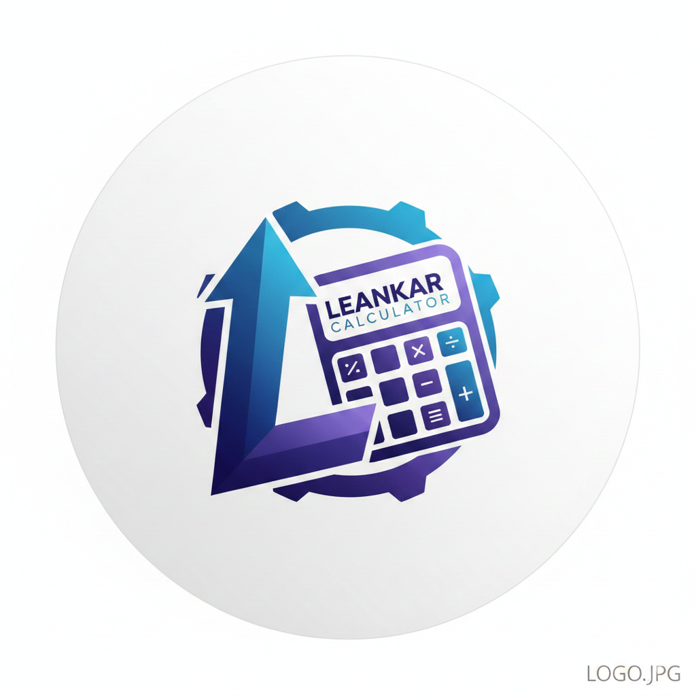

# Calculadora Neumórfica / Neumorphic Calculator / Calculadora Neumórfica

<p align="center">
  
</p>

---

## Idiomas / Languages / Idiomas

- [Português (BR)](#português-br)
- [English](#english)
- [Español](#español)

---

# Português (BR)

## Calculadora Neumórfica

Uma calculadora Flutter com design neumórfico moderno, desenvolvida seguindo as melhores práticas de arquitetura e testes.

### Funcionalidades

- Operações aritméticas básicas: adição, subtração, multiplicação e divisão
- Cálculo de porcentagem
- Suporte a entrada via teclado físico
- Design neumórfico elegante
- Suporte a tema claro/escuro
- Separador decimal com vírgula (padrão brasileiro)
- Tratamento de erro para divisão por zero
- Histórico de cálculos com persistência local
- Copiar/colar resultados (Ctrl+C / Ctrl+V)
- Formatação automática de números grandes
- Calculadora científica (trigonometria em graus/radianos, logaritmos, raiz, potência, fatorial, parênteses e memória)
- Calculadora de IMC com classificação e peso ideal
- Tela de configurações (tema e idioma)
- Suporte a 5 idiomas: inglês, espanhol, francês, italiano e português (Brasil)
- Splash animada "Teclas em Órbita" (toque para pular e respeito ao modo de movimento reduzido)
- Anúncios banner via Unity LevelPlay, exclusivos da versão Android, com diálogo de consentimento próprio (sem AdMob/UMP)

### Capturas de Tela

A calculadora apresenta um design neumórfico com botões em alto-relevo e display em baixo-relevo, proporcionando uma experiência visual moderna e agradável.

### Atalhos de Teclado

| Tecla | Ação |
|-------|------|
| `0-9` | Inserir números |
| `+`, `-`, `*`, `/` | Operações |
| `,` ou `.` | Separador decimal |
| `Enter` ou `=` | Calcular resultado |
| `Backspace` | Apagar último dígito |
| `Escape` ou `Delete` | Limpar tudo |
| `%` | Calcular porcentagem |
| `C` | Limpar display |
| `Ctrl+C` | Copiar resultado |
| `Ctrl+V` | Colar número |
| `H` | Abrir histórico |

### Como Executar

```bash
# Clonar o repositório
git clone <url-do-repositorio>

# Entrar no diretório
cd calculator_leankar

# Instalar dependências
flutter pub get

# Criar o .env a partir de .env.example e preencher UNITY_APP_KEY_ANDROID
cp .env.example .env

# Gerar o código do envied (chave do Unity App)
dart run build_runner build --delete-conflicting-outputs

# Executar o app
flutter run

# Executar testes
flutter test

# Analisar código
flutter analyze
```

### Tecnologias

- **Dart SDK** ^3.12.0
- [flutter_neumorphic_plus](https://pub.dev/packages/flutter_neumorphic_plus) - Design neumórfico
- [shared_preferences](https://pub.dev/packages/shared_preferences) - Persistência local
- [intl](https://pub.dev/packages/intl) - Formatação de números e suporte a i18n
- [package_info_plus](https://pub.dev/packages/package_info_plus) - Informações de versão do app
- [unity_levelplay_mediation](https://pub.dev/packages/unity_levelplay_mediation) - Anúncios banner via Unity LevelPlay (Android)
- [envied](https://pub.dev/packages/envied) + `build_runner` - Chave do Unity App carregada de forma ofuscada a partir de `.env`
- [flutter_native_splash](https://pub.dev/packages/flutter_native_splash) - Splash screen nativa
- `flutter_localizations` - Internacionalização (5 idiomas)

### Arquitetura

O app segue um padrão de controllers (`ChangeNotifier`) + páginas + widgets, com dependências injetadas via construtor (fallback para singleton `.instance`) — sem framework de DI:

```
lib/
├── main.dart                                       # Ponto de entrada (delega ao bootstrap)
├── app/
│   ├── bootstrap.dart                              # Inicialização: splash, handlers de erro, orientação e estado persistido
│   └── app_calculator.dart                         # Widget raiz (tema, idioma e tela inicial)
├── controllers/
│   ├── calculator_controller.dart                  # Lógica da calculadora (ChangeNotifier)
│   ├── calculator_state.dart                       # Estado imutável da calculadora
│   ├── scientific_calculator_controller.dart       # Lógica da calculadora científica
│   ├── scientific_calculator_state.dart            # Estado imutável da calculadora científica
│   ├── imc_controller.dart                         # Lógica do IMC
│   ├── settings_controller.dart                    # Tema/idioma
│   ├── ad_consent_controller.dart                  # Diálogo de consentimento próprio para anúncios (sem UMP)
│   ├── ad_consent_state.dart
│   ├── splash_controller.dart                      # Controller e estado imutável da splash
│   └── splash_state.dart                           # Estado imutável da splash
├── models/
│   ├── calculation_history.dart                    # Modelo do histórico de cálculos
│   ├── expression_token.dart                       # Token de expressão da calculadora científica
│   ├── imc_result.dart                             # Modelo do resultado de IMC
│   ├── splash_key_placement.dart                   # Posição calculada de cada tecla da órbita
│   └── splash_layout_metrics.dart                  # Medidas proporcionais da splash
├── pages/
│   ├── calculator_page.dart                        # Tela principal (StatefulWidget)
│   ├── scientific_calculator_page.dart             # Tela da calculadora científica
│   ├── imc_calculator_page.dart                    # Tela de IMC
│   ├── settings_page.dart                          # Tela de configurações
│   └── splash_page.dart                            # Splash animada (tela inicial)
├── services/
│   ├── level_play_ad_service.dart                  # Integração com Unity LevelPlay (Android)
│   ├── error_handler.dart                          # Tratamento centralizado de erros
│   ├── logger_service.dart                         # Serviço de logging para debug
│   ├── storage_service.dart                        # Persistência com SharedPreferences
│   ├── expression_tokenizer_service.dart           # Tokenização de expressões
│   ├── shunting_yard_service.dart                  # Conversão de notação infixa para polonesa reversa
│   ├── rpn_evaluator_service.dart                  # Avaliação em notação polonesa reversa
│   ├── expression_evaluator_service.dart           # Avaliação de expressões (orquestra as etapas anteriores)
│   └── trigonometry_service.dart                   # Funções trigonométricas (graus/radianos)
├── widgets/
│   ├── ads/                                        # Banner de anúncios, diálogo de consentimento e placeholder
│   ├── imc/                                        # Widgets da calculadora de IMC
│   ├── scientific/                                 # Teclado e linhas da calculadora científica
│   ├── settings/                                   # Widgets da tela de configurações
│   ├── splash/                                     # Fundo, logo, teclas em órbita, título e tagline da splash
│   └── ...                                         # Widgets da calculadora (botão, display, teclado, histórico, drawer)
├── utils/
│   ├── constants/                                  # Cores, tamanhos, strings, IDs de anúncio e linha do tempo da splash
│   ├── enums/                                      # Tipos de erro, operações, IMC, funções científicas, etc.
│   ├── exceptions/                                 # Exceções da calculadora científica
│   ├── extensions/                                 # Extensões de localização e de listas
│   ├── keyboard/                                   # Mapeamento de teclas físicas para ações
│   ├── mixins/                                     # Feedback de copiar/colar
│   ├── env/                                        # Chave do Unity App via envied (gerado a partir de .env)
│   ├── ad_platform_support.dart                    # Suporte a anúncios por plataforma
│   ├── expression_serializer.dart                  # Serialização de expressões
│   ├── number_formatter.dart                       # Formatação de números grandes
│   ├── numeric_precision.dart                      # Correção de precisão numérica
│   ├── responsive_utils.dart                       # Utilitários responsivos
│   └── result.dart                                 # Padrão Result para tratamento de erros
└── l10n/                                           # Arquivos .arb (en, es, fr, it, pt, pt_BR) + código gerado
```

### Testes

O projeto possui cobertura ampla de testes, organizados espelhando a estrutura de `lib/`:

```
test/
├── controllers/    # Testes de calculator/imc/settings/ad_consent controllers
├── mocks/          # Mocks manuais (storage, logger, error handler, level_play_ad_service)
├── models/         # Testes de modelos (ex.: imc_result)
├── pages/          # Testes das páginas (calculator, imc, settings)
├── services/       # Testes de serviços (ex.: level_play_ad_service)
├── utils/          # Testes de formatação e enums
├── helpers/        # Utilitários de teste (app de teste com l10n)
└── widgets/        # Testes de widgets, incluindo ads/, imc/ e settings/
```

**Total: 980 testes automatizados**

### Padrões de Código

- Todos os widgets são implementados como classes (`StatelessWidget` ou `StatefulWidget`)
- Gerenciamento de estado com `ChangeNotifier` e estado imutável (`copyWith`)
- Separação de responsabilidades entre UI e lógica
- Nomenclatura consistente e em inglês
- Testes automatizados para todas as funcionalidades, com mocks injetados via construtor

---

# English

## Neumorphic Calculator

A Flutter calculator with modern neumorphic design, developed following best practices for architecture and testing.

### Features

- Basic arithmetic operations: addition, subtraction, multiplication, and division
- Percentage calculation
- Physical keyboard input support
- Elegant neumorphic design
- Light/dark theme support
- Comma as decimal separator (Brazilian standard)
- Error handling for division by zero
- Calculation history with local persistence
- Copy/paste results (Ctrl+C / Ctrl+V)
- Automatic formatting for large numbers
- Scientific calculator (trigonometry in degrees/radians, logarithms, square root, power, factorial, parentheses and memory)
- BMI calculator with classification and ideal weight
- Settings screen (theme and language)
- Support for 5 languages: English, Spanish, French, Italian, and Portuguese (Brazil)
- Animated "Orbiting Keys" splash screen (tap to skip, honors reduced motion)
- Banner ads via Unity LevelPlay, Android only, with a custom in-app consent dialog (no AdMob/UMP)

### Screenshots

The calculator features a neumorphic design with embossed buttons and engraved display, providing a modern and pleasant visual experience.

### Keyboard Shortcuts

| Key | Action |
|-----|--------|
| `0-9` | Insert numbers |
| `+`, `-`, `*`, `/` | Operations |
| `,` or `.` | Decimal separator |
| `Enter` or `=` | Calculate result |
| `Backspace` | Delete last digit |
| `Escape` or `Delete` | Clear all |
| `%` | Calculate percentage |
| `C` | Clear display |
| `Ctrl+C` | Copy result |
| `Ctrl+V` | Paste number |
| `H` | Open history |

### How to Run

```bash
# Clone the repository
git clone <repository-url>

# Enter the directory
cd calculator_leankar

# Install dependencies
flutter pub get

# Create .env from .env.example and fill in UNITY_APP_KEY_ANDROID
cp .env.example .env

# Generate envied code (Unity App key)
dart run build_runner build --delete-conflicting-outputs

# Run the app
flutter run

# Run tests
flutter test

# Analyze code
flutter analyze
```

### Technologies

- **Dart SDK** ^3.12.0
- [flutter_neumorphic_plus](https://pub.dev/packages/flutter_neumorphic_plus) - Neumorphic design
- [shared_preferences](https://pub.dev/packages/shared_preferences) - Local persistence
- [intl](https://pub.dev/packages/intl) - Number formatting and i18n support
- [package_info_plus](https://pub.dev/packages/package_info_plus) - App version info
- [unity_levelplay_mediation](https://pub.dev/packages/unity_levelplay_mediation) - Banner ads via Unity LevelPlay (Android)
- [envied](https://pub.dev/packages/envied) + `build_runner` - Unity App key loaded obfuscated from `.env`
- [flutter_native_splash](https://pub.dev/packages/flutter_native_splash) - Native splash screen
- `flutter_localizations` - Internationalization (5 languages)

### Architecture

The app follows a controller (`ChangeNotifier`) + pages + widgets pattern, with dependencies injected via constructor (falling back to a `.instance` singleton) — no DI framework:

```
lib/
├── main.dart                                       # Entry point (delegates to bootstrap)
├── app/
│   ├── bootstrap.dart                              # Initialization: splash, error handlers, orientation and persisted state
│   └── app_calculator.dart                         # Root widget (theme, language and home screen)
├── controllers/
│   ├── calculator_controller.dart                  # Calculator business logic (ChangeNotifier)
│   ├── calculator_state.dart                       # Immutable calculator state
│   ├── scientific_calculator_controller.dart       # Scientific calculator business logic
│   ├── scientific_calculator_state.dart            # Immutable scientific calculator state
│   ├── imc_controller.dart                         # BMI business logic
│   ├── settings_controller.dart                    # Theme/language
│   ├── ad_consent_controller.dart                  # Custom in-app ad consent dialog (no UMP)
│   ├── ad_consent_state.dart
│   ├── splash_controller.dart                      # Splash state machine (ChangeNotifier)
│   └── splash_state.dart                           # Immutable splash state
├── models/
│   ├── calculation_history.dart                    # Calculation history model
│   ├── expression_token.dart                       # Expression token for the scientific calculator
│   ├── imc_result.dart                             # BMI result model
│   ├── splash_key_placement.dart                   # Computed position of each orbiting key
│   └── splash_layout_metrics.dart                  # Proportional splash measurements
├── pages/
│   ├── calculator_page.dart                        # Main screen (StatefulWidget)
│   ├── scientific_calculator_page.dart             # Scientific calculator screen
│   ├── imc_calculator_page.dart                    # BMI screen
│   ├── settings_page.dart                          # Settings screen
│   └── splash_page.dart                            # Animated splash (home screen)
├── services/
│   ├── level_play_ad_service.dart                  # Unity LevelPlay integration (Android)
│   ├── error_handler.dart                          # Centralized error handling
│   ├── logger_service.dart                         # Logging service for debug
│   ├── storage_service.dart                        # Persistence with SharedPreferences
│   ├── expression_tokenizer_service.dart           # Expression tokenization
│   ├── shunting_yard_service.dart                  # Infix to reverse Polish notation conversion
│   ├── rpn_evaluator_service.dart                  # Reverse Polish notation evaluation
│   ├── expression_evaluator_service.dart           # Expression evaluation (orchestrates the previous steps)
│   └── trigonometry_service.dart                   # Trigonometric functions (degrees/radians)
├── widgets/
│   ├── ads/                                        # Ad banner, consent dialog and placeholder
│   ├── imc/                                        # BMI calculator widgets
│   ├── scientific/                                 # Scientific calculator keypad and rows
│   ├── settings/                                   # Settings screen widgets
│   ├── splash/                                     # Splash background, logo, orbiting keys, title and tagline
│   └── ...                                         # Calculator widgets (button, display, keypad, history, drawer)
├── utils/
│   ├── constants/                                  # Colors, sizes, strings, ad unit IDs and splash timeline
│   ├── enums/                                      # Error types, operations, BMI, scientific functions, etc.
│   ├── exceptions/                                 # Scientific calculator exceptions
│   ├── extensions/                                 # Localization and list extensions
│   ├── keyboard/                                   # Physical key to action mapping
│   ├── mixins/                                     # Copy/paste feedback
│   ├── env/                                        # Unity App key via envied (generated from .env)
│   ├── ad_platform_support.dart                    # Per-platform ad support
│   ├── expression_serializer.dart                  # Expression serialization
│   ├── number_formatter.dart                       # Large number formatting
│   ├── numeric_precision.dart                      # Numeric precision correction
│   ├── responsive_utils.dart                       # Responsive utilities
│   └── result.dart                                 # Result pattern for error handling
└── l10n/                                           # .arb files (en, es, fr, it, pt, pt_BR) + generated code
```

### Tests

The project has broad test coverage, mirroring the `lib/` structure:

```
test/
├── controllers/    # Calculator/imc/settings/ad_consent controller tests
├── mocks/          # Hand-written mocks (storage, logger, error handler, level_play_ad_service)
├── models/         # Model tests (e.g. imc_result)
├── pages/          # Page tests (calculator, imc, settings)
├── services/       # Service tests (e.g. level_play_ad_service)
├── utils/          # Formatting and enum tests
├── helpers/        # Test helpers (l10n-aware test app)
└── widgets/        # Widget tests, including ads/, imc/, and settings/
```

**Total: 980 automated tests**

### Code Standards

- All widgets are implemented as classes (`StatelessWidget` or `StatefulWidget`)
- State management with `ChangeNotifier` and immutable state (`copyWith`)
- Separation of concerns between UI and logic
- Consistent naming conventions in English
- Automated tests for all features, with mocks injected via constructor

---

# Español

## Calculadora Neumórfica

Una calculadora Flutter con diseño neumórfico moderno, desarrollada siguiendo las mejores prácticas de arquitectura y pruebas.

### Funcionalidades

- Operaciones aritméticas básicas: suma, resta, multiplicación y división
- Cálculo de porcentaje
- Soporte para entrada por teclado físico
- Diseño neumórfico elegante
- Soporte para tema claro/oscuro
- Coma como separador decimal (estándar brasileño)
- Manejo de errores para división por cero
- Historial de cálculos con persistencia local
- Copiar/pegar resultados (Ctrl+C / Ctrl+V)
- Formato automático para números grandes
- Calculadora científica (trigonometría en grados/radianes, logaritmos, raíz, potencia, factorial, paréntesis y memoria)
- Calculadora de IMC con clasificación y peso ideal
- Pantalla de configuración (tema e idioma)
- Soporte para 5 idiomas: inglés, español, francés, italiano y portugués (Brasil)
- Splash animada "Teclas en Órbita" (toque para saltar y respeta el movimiento reducido)
- Anuncios banner mediante Unity LevelPlay, exclusivos de la versión Android, con un diálogo de consentimiento propio (sin AdMob/UMP)

### Capturas de Pantalla

La calculadora presenta un diseño neumórfico con botones en relieve y pantalla hundida, proporcionando una experiencia visual moderna y agradable.

### Atajos de Teclado

| Tecla | Acción |
|-------|--------|
| `0-9` | Insertar números |
| `+`, `-`, `*`, `/` | Operaciones |
| `,` o `.` | Separador decimal |
| `Enter` o `=` | Calcular resultado |
| `Backspace` | Borrar último dígito |
| `Escape` o `Delete` | Limpiar todo |
| `%` | Calcular porcentaje |
| `C` | Limpiar pantalla |
| `Ctrl+C` | Copiar resultado |
| `Ctrl+V` | Pegar número |
| `H` | Abrir historial |

### Cómo Ejecutar

```bash
# Clonar el repositorio
git clone <url-del-repositorio>

# Entrar en el directorio
cd calculator_leankar

# Instalar dependencias
flutter pub get

# Crear el .env a partir de .env.example y completar UNITY_APP_KEY_ANDROID
cp .env.example .env

# Generar el código de envied (clave del Unity App)
dart run build_runner build --delete-conflicting-outputs

# Ejecutar la app
flutter run

# Ejecutar pruebas
flutter test

# Analizar código
flutter analyze
```

### Tecnologías

- **Dart SDK** ^3.12.0
- [flutter_neumorphic_plus](https://pub.dev/packages/flutter_neumorphic_plus) - Diseño neumórfico
- [shared_preferences](https://pub.dev/packages/shared_preferences) - Persistencia local
- [intl](https://pub.dev/packages/intl) - Formato de números y soporte de i18n
- [package_info_plus](https://pub.dev/packages/package_info_plus) - Información de versión de la app
- [unity_levelplay_mediation](https://pub.dev/packages/unity_levelplay_mediation) - Anuncios banner mediante Unity LevelPlay (Android)
- [envied](https://pub.dev/packages/envied) + `build_runner` - Clave del Unity App cargada de forma ofuscada desde `.env`
- [flutter_native_splash](https://pub.dev/packages/flutter_native_splash) - Splash screen nativa
- `flutter_localizations` - Internacionalización (5 idiomas)

### Arquitectura

La app sigue un patrón de controllers (`ChangeNotifier`) + páginas + widgets, con dependencias inyectadas vía constructor (con fallback a singleton `.instance`) — sin framework de DI:

```
lib/
├── main.dart                                       # Punto de entrada (delega al bootstrap)
├── app/
│   ├── bootstrap.dart                              # Inicialización: splash, handlers de error, orientación y estado persistido
│   └── app_calculator.dart                         # Widget raíz (tema, idioma y pantalla inicial)
├── controllers/
│   ├── calculator_controller.dart                  # Lógica de la calculadora (ChangeNotifier)
│   ├── calculator_state.dart                       # Estado inmutable de la calculadora
│   ├── scientific_calculator_controller.dart       # Lógica de la calculadora científica
│   ├── scientific_calculator_state.dart            # Estado inmutable de la calculadora científica
│   ├── imc_controller.dart                         # Lógica del IMC
│   ├── settings_controller.dart                    # Tema/idioma
│   ├── ad_consent_controller.dart                  # Diálogo de consentimiento propio para anuncios (sin UMP)
│   ├── ad_consent_state.dart
│   ├── splash_controller.dart                      # Máquina de estados de la splash (ChangeNotifier)
│   └── splash_state.dart                           # Estado inmutable de la splash
├── models/
│   ├── calculation_history.dart                    # Modelo del historial de cálculos
│   ├── expression_token.dart                       # Token de expresión de la calculadora científica
│   ├── imc_result.dart                             # Modelo del resultado de IMC
│   ├── splash_key_placement.dart                   # Posición calculada de cada tecla de la órbita
│   └── splash_layout_metrics.dart                  # Medidas proporcionales de la splash
├── pages/
│   ├── calculator_page.dart                        # Pantalla principal (StatefulWidget)
│   ├── scientific_calculator_page.dart             # Pantalla de la calculadora científica
│   ├── imc_calculator_page.dart                    # Pantalla de IMC
│   ├── settings_page.dart                          # Pantalla de configuración
│   └── splash_page.dart                            # Splash animada (pantalla inicial)
├── services/
│   ├── level_play_ad_service.dart                  # Integración con Unity LevelPlay (Android)
│   ├── error_handler.dart                          # Manejo centralizado de errores
│   ├── logger_service.dart                         # Servicio de logging para debug
│   ├── storage_service.dart                        # Persistencia con SharedPreferences
│   ├── expression_tokenizer_service.dart           # Tokenización de expresiones
│   ├── shunting_yard_service.dart                  # Conversión de notación infija a polaca inversa
│   ├── rpn_evaluator_service.dart                  # Evaluación en notación polaca inversa
│   ├── expression_evaluator_service.dart           # Evaluación de expresiones (orquesta los pasos anteriores)
│   └── trigonometry_service.dart                   # Funciones trigonométricas (grados/radianes)
├── widgets/
│   ├── ads/                                        # Banner de anuncios, diálogo de consentimiento y placeholder
│   ├── imc/                                        # Widgets de la calculadora de IMC
│   ├── scientific/                                 # Teclado y filas de la calculadora científica
│   ├── settings/                                   # Widgets de la pantalla de configuración
│   ├── splash/                                     # Fondo, logo, teclas en órbita, título y tagline de la splash
│   └── ...                                         # Widgets de la calculadora (botón, display, teclado, historial, drawer)
├── utils/
│   ├── constants/                                  # Colores, tamaños, strings, IDs de anuncio y línea de tiempo de la splash
│   ├── enums/                                      # Tipos de error, operaciones, IMC, funciones científicas, etc.
│   ├── exceptions/                                 # Excepciones de la calculadora científica
│   ├── extensions/                                 # Extensiones de localización y de listas
│   ├── keyboard/                                   # Mapeo de teclas físicas a acciones
│   ├── mixins/                                     # Feedback de copiar/pegar
│   ├── env/                                        # Clave del Unity App vía envied (generada desde .env)
│   ├── ad_platform_support.dart                    # Soporte de anuncios por plataforma
│   ├── expression_serializer.dart                  # Serialización de expresiones
│   ├── number_formatter.dart                       # Formato de números grandes
│   ├── numeric_precision.dart                      # Corrección de precisión numérica
│   ├── responsive_utils.dart                       # Utilidades responsivas
│   └── result.dart                                 # Patrón Result para manejo de errores
└── l10n/                                           # Archivos .arb (en, es, fr, it, pt, pt_BR) + código generado
```

### Pruebas

El proyecto tiene amplia cobertura de pruebas, organizadas reflejando la estructura de `lib/`:

```
test/
├── controllers/    # Pruebas de calculator/imc/settings/ad_consent controllers
├── mocks/          # Mocks manuales (storage, logger, error handler, level_play_ad_service)
├── models/         # Pruebas de modelos (ej.: imc_result)
├── pages/          # Pruebas de páginas (calculator, imc, settings)
├── services/       # Pruebas de servicios (ej.: level_play_ad_service)
├── utils/          # Pruebas de formato y enums
├── helpers/        # Utilidades de prueba (app de prueba con l10n)
└── widgets/        # Pruebas de widgets, incluyendo ads/, imc/ y settings/
```

**Total: 980 pruebas automatizadas**

### Estándares de Código

- Todos los widgets están implementados como clases (`StatelessWidget` o `StatefulWidget`)
- Gestión de estado con `ChangeNotifier` y estado inmutable (`copyWith`)
- Separación de responsabilidades entre UI y lógica
- Nomenclatura consistente en inglés
- Pruebas automatizadas para todas las funcionalidades, con mocks inyectados vía constructor

---

## Autor / Author / Autor

<p align="center">
  <strong>LeanKar Dev</strong><br>
  📧 leankar.dev@gmail.com<br>
  🌐 <a href="https://leankar.dev">https://leankar.dev</a>
</p>

---

## Licença / License / Licencia

Este projeto está sob a licença MIT. / This project is under the MIT license. / Este proyecto está bajo la licencia MIT.
